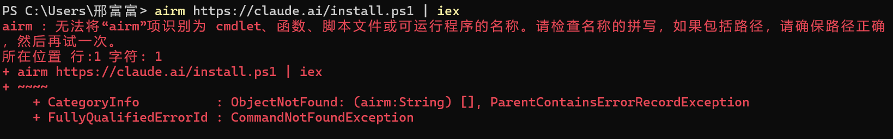
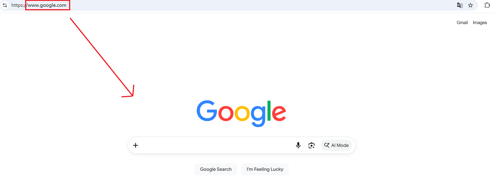
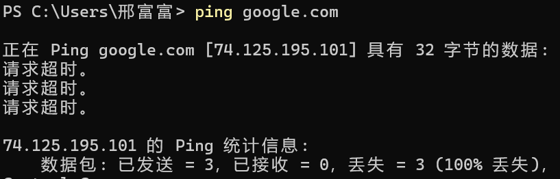
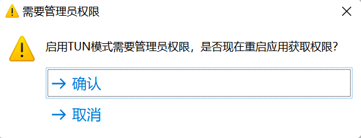
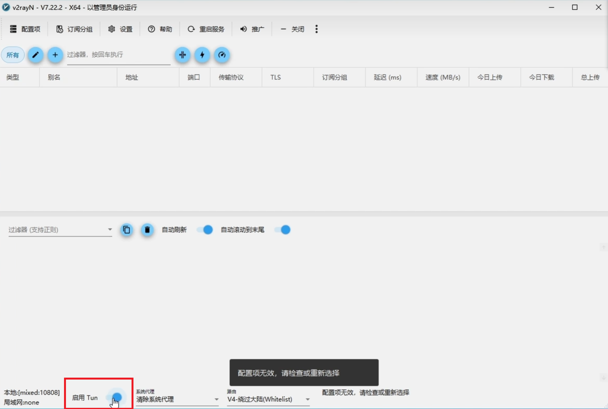

#Claude Code官方安装时报错解决
## 1. 国内科学上网下载Claude Code时，使用官方安装脚本(原生安装)
```powershell
irm https://claude.ai/install.ps1 | iex
```
会报错

## 2. 解释说明，通常因为科学上网时，没有开启全局代理
仅有浏览器可以科学上网

但在本地PowerShell上无法ping通google.com
```powershell
ping google.com
```

这就说明科学上网没有开启全局，仅有浏览器能科学上网
## 3. 解决方法，通过科学上网软件开启TUN模式(虚拟网卡)
下面列举几个常用软件
###Clash Party
关闭 系统代理，开启虚拟网卡(TUN模式)


###v2rayN

